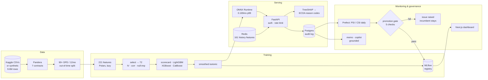

# CreditLens

**A lender submits a loan application. CreditLens returns, in under 150ms: a
probability of default, a 300–850 score, an approve / refer / decline decision,
four ECOA-compliant reason codes, and the SHAP attributions behind them.**

Behind that sits the rest of what a bank actually needs before a model may make
decisions — out-of-time validation, calibrated probabilities, drift monitoring,
fairness measurement, an append-only audit log, an automated promotion gate, and
the governance documents a model validation team would ask for.

> **Status: complete, 7 of 7 phases.** Two things are stated plainly rather than
> buried: the model is trained on a **synthetic generator**, because neither
> Kaggle source can be downloaded non-interactively; and the **LLM features have
> never made a live API call**, because no credentials were available. Both are
> in the limitations, and every other number here is reproducible from this repo.

---

## Headline numbers

Out-of-time test fold — 16,276 applications, 16.81% bad rate, never touched
during training, tuning or model selection.

| | Value | Baseline |
|---|---|---|
| **Gini** | **0.5826** | 0.5249 |
| **KS** | **0.4348** | 0.3818 |
| **AUC** | **0.7913** | 0.7624 |
| **Brier** (calibrated) | **0.1148** | 0.2066 |
| **Score PSI** | 0.0174 — stable | — |
| **p99 latency** | **46 ms** end-to-end, 0.169 ms model | — |
| **Cost per 1,000 decisions** | **$1.00** in LLM spend | — |

Rank ordering monotonic across all ten deciles. Every figure is regenerated by
`make train && make audit && make docs`.

```bash
make setup && make data && make train    # ~6 min: 9.6M rows → calibrated champion
make up                                  # API + Postgres + Redis + MLflow + dashboard
```

---

## Architecture



---

## What is here, and why it is unusual

**Calibration is treated as load-bearing, not decoration.** Class reweighting
pushed mean predicted PD to 43% against a true rate of 17%. Expected-loss
arithmetic on that would be wrong by 2.5× while every discrimination metric
looked healthy. Isotonic on a held-out fold takes ECE from 0.265 to 0.013.

**The monotonic constraints were tested, not assumed.** LightGBM's documented
`advanced` enforcement admitted a real violation; `basic` held exactly and
scored slightly better.

**Every decline produces four distinct reasons — 100% of them.** Not four
restatements of one factor. The model's strongest feature embeds age; it is
disclosed as a bureau-score reason so no protected attribute is ever named.

**The fairness section reports a failure.** Disparate impact 0.3843 on age. No
legally deployable mitigation reaches 0.80. A fairness section that only reports
passes is worthless.

**The promotion gate was tested in both directions.** A gate only ever tried
against a good candidate is a gate nobody knows works.

**Ten ADRs record the decisions**, including the ones that were wrong first.

## Documentation

| Document | What it covers |
|---|---|
| [Model card](docs/model_card.md) | Intended use, performance by segment, limitations, ethics |
| [Validation report](docs/model_validation_report.md) | SR 11-7: conceptual soundness, outcomes, monitoring |
| [Credit policy](docs/credit_policy.md) | Cutoffs, referral rules, overrides — also the RAG corpus |
| [Data dictionary](docs/data_dictionary.md) | All 221 features: source, IV, direction, SHAP share |
| [Target definition](docs/target_definition.md) | Binding. Every metric depends on it |
| [Fairness findings](docs/fairness_findings.md) | Measured disparity and what mitigation costs |
| [ADRs 0001–0010](docs/adr/) | Decisions, tradeoffs, and the ones revised later |
| [Demo script](docs/demo_script.md) | Three-minute walkthrough |

The model card, validation report and data dictionary are **generated** by
`make docs` from the training artifacts. A governance document whose numbers
disagree with the model is worse than none, because it will be believed.

---

## Quickstart

```bash
make setup       # uv venv + dependencies
make data        # synthetic dataset: 50k applicants, 9.6M rows across 7 tables
make train       # features → selection → 4 tracks → calibration → MLflow  (~6 min)
make audit       # SHAP, reason codes, counterfactuals, fairness
make docs        # regenerate model card, validation report, data dictionary
make test        # 249 tests
```

Serving, either way:

```bash
make up                              # everything in containers
# or
make warm-cache && make serve        # API on :8000, docs at /docs
make demo-data && make ui            # dashboard on :3000
```

```bash
curl -s -X POST localhost:8000/v1/score \
  -H "X-API-Key: demo-key-underwriter" -H "Content-Type: application/json" \
  -d @artifacts/one_payload.json
```

```
pd 0.2979 | score 511.9 | decline | 9.4ms
reasons: Debt-to-income, Repayment record, Delinquency on credit file, Prior application history
```

275 tests, 73% coverage on `src/`.

---

## Known gaps

Named rather than hidden. Each is a real limitation of this build:

| Gap | Detail |
|---|---|
| **Synthetic training data** | Neither Kaggle source downloads non-interactively. Loaders read real CSVs the moment they exist; no number here describes real borrowers |
| **LLM live calls unverified** | No Anthropic credentials. Guardrails are tested; live behaviour is not. Both features run deterministic offline paths, labelled in the UI |
| **Fails four-fifths on age** | DI 0.3843. Requires fair-lending review before any real use |
| **No database migrations** | `create_all()` creates missing tables but never alters one. A schema-drift check fails loudly at startup; Alembic is the right fix |
| **Rate limiter is in-process** | With N workers the effective ceiling is N× the configured limit. Belongs in Redis |
| **Retrieval is BM25, not pgvector** | No embedding service available. pgvector remains the right destination |
| **No demo video** | A written [demo script](docs/demo_script.md) instead |

---

## Getting the data

The pipeline runs today on a **synthetic generator** that emits the real Home
Credit table and column names, wired to a latent per-applicant risk factor so the
relational aggregations in Phase 2 carry genuine signal rather than noise.

Both Kaggle sources need an authenticated download, and Home Credit additionally
requires accepting the competition rules in a browser, so neither can be fetched
non-interactively:

```bash
pip install kaggle   # then place kaggle.json in ~/.kaggle/
kaggle competitions download -c home-credit-default-risk -p data/raw && unzip -o 'data/raw/*.zip' -d data/raw
```

Drop the CSVs in `data/raw/` and **the whole pipeline switches over with no code
change** — `src/ingestion/loaders.py` prefers real files and falls back to
synthetic. Check what will be read with `make validate` or:

```bash
.venv/bin/python -m src.cli sources
```

Synthetic scale today: 50,000 applicants across 7 tables, **9.6M rows total**.

## The target

**Bad = 90+ days past due within 12 months of origination.** Full rationale,
including the indeterminate band and the right-censoring rule, in
[`docs/target_definition.md`](docs/target_definition.md).

The definition is enforced in code, not just documented:

- 30–89 DPD is **indeterminate** — excluded from training, scored at evaluation.
- Loans whose 12-month window has not closed are **censored and dropped**, even
  if already 200 DPD. Keeping them would manufacture clean records in exactly the
  recent vintages the model is judged on.
- Splits are **out-of-time**, and `assert_no_temporal_leakage` fails the run if
  any fold's date range overlaps a later one.

### The Home Credit caveat, stated up front

**Home Credit has no application date.** It is a single snapshot with a prebuilt
binary `TARGET`, so a genuine out-of-time split on it is impossible. Rather than
invent a date, this project splits the roles: Home Credit supplies the
**relational feature engineering**, Lending Club (which has a real `issue_d`)
supplies **out-of-time evaluation, vintage analysis and PSI**, and the synthetic
generator carries a real origination calendar so the OOT machinery is exercisable
now. The real-data loader writes a **null** date sentinel, never a guess.

## How it was built

Seven phases, each ending in something demoable, each committed separately.

| Phase | Delivered |
|---|---|
| 1 | Data layer, Pandera contracts, target definition, out-of-time splits, logistic baseline |
| 2 | 221-feature Polars pipeline, WOE/IV, four model tracks with Optuna, calibration, MLflow |
| 3 | SHAP service, ECOA reason codes, counterfactual levers, Fairlearn audit |
| 4 | FastAPI, ONNX serving, Redis feature cache, Postgres audit log, Locust |
| 5 | Next.js dashboard, seven pages, client-side cutoff simulator |
| 6 | Prefect flows, automated promotion gate, memo generator, analyst copilot |
| 7 | Model card, SR 11-7 validation report, data dictionary, Terraform, README |

Several phases revised an earlier one. Phase 2 found the synthetic generator
needed two latent factors, not one; Phase 3 found plain isotonic unusable as a
decisioning score; Phase 4 found the serving image genuinely needed CatBoost
after the Dockerfile claimed otherwise. Those revisions are in the ADRs rather
than quietly folded in.

## Explainability and adverse action

`make audit` produces the full report; `make explain` prints one applicant.

**The Phase 3 deliverable: 100% of declines produce exactly four distinct,
ranked, human-readable reasons.** A real one, straight from the CLI:

```
applicant 100003  PD 0.2979  score 512  -> decline  (approve at 539)
  1. [Debt-to-income] Proposed monthly payment is high relative to stated income
  2. [Repayment record] Record of late or partial payments on prior obligations
  3. [Delinquency on credit file] Credit file shows past-due amounts or accounts reported delinquent
  4. [Prior application history] Record of recent declined or withdrawn credit applications
```

Three properties make that compliant rather than decorative:

**Distinct, not restated.** The top four raw SHAP contributions are usually four
measurements of one thing. Contributions are summed into 11 ECOA families and
ranked, so four reasons means four different reasons. Verified across every
decline: mean 4.00 distinct families, minimum 4.

**Blind to protected attributes.** The model's single strongest feature is
`EXT_mean_x_age`, which embeds age. It is disclosed as a credit-bureau-score
reason, never as an age reason, and a suppression list keeps age, sex, family
status and dependents out of any disclosure. See
[ADR 0005](docs/adr/0005-reason-codes-and-protected-attributes.md).

**No silent gaps.** All 221 features are either mapped to a family (212) or
explicitly suppressed (9). A test fails the build if that ever stops being true —
an unmapped feature would be silently dropped from a legally required disclosure.

SHAP wiring is checked by additivity: `expected_value + sum(shap)` must equal the
raw margin, and it does to **6.7e-15**. That check earned its place twice —
it caught a stale cached base value (SHAP mutates `expected_value` after the
first call) and a dispatch bug where `LGBMClassifier.predict` silently swallowed
a CatBoost keyword and returned class labels as "margin".

### Counterfactuals: what would have to change

Proposals are expressed as **levers** — one real-world action propagating to
every model feature it would actually move. Feature selection keeps *ratios*
rather than raw amounts, so a naive per-feature sweep would propose an incoherent
applicant who borrows less but repays the same.

| Lever | Moves |
|---|---|
| Request a smaller loan | every amount-derived ratio together, plus residual income |
| Pay down revolving balances | all utilisation and balance measures |
| Bring past-due balances current | every overdue measure |
| Repay existing debt | bureau debt levels and debt-to-income |

Past conduct, external scores, employment tenure and every protected attribute
are **excluded from the search space entirely** — you cannot tell someone to have
had fewer delinquencies last year.

**The honest result: most declines cannot be reversed by any feasible action.**
Of 120 declines, 0 flip on a single action and 1 flips on up to three. Median
achievable gain is 11.7 score points against gaps that are usually larger.

That is not a broken module — it is what the data says, and the segmentation
confirms the levers target the right things:

| Decline driven by | n | Median score gain | Max |
|---|---|---|---|
| Actionable causes (affordability, utilisation, debt) | 19 | **+22.3** | +46.3 |
| Credit history | 101 | +10.3 | +42.3 |

Applicants declined for reasons they can act on get twice the benefit. For
everyone else the module says so plainly rather than manufacturing advice.

## Fairness

Full analysis in [docs/fairness_findings.md](docs/fairness_findings.md). Every
metric is computed twice — once in this repo, once through Fairlearn — and the
two agree to **0.00e+00**.

| Attribute | Disparate impact | Four-fifths rule | Equal-opportunity gap |
|---|---|---|---|
| Gender | 0.9782 | passes | 0.0170 |
| Age band | **0.3843** | **fails** | 0.4921 |

**The model fails the four-fifths rule on age**, approving the 18-24 band at 38%
of the rate of the 65+ band. Stated plainly because a fairness section that only
reports passes is worthless.

Context that belongs alongside it, not instead of it: observed bad rate falls
monotonically from 26.4% (18-24) to 7.1% (65+), so the model is measuring a real
difference rather than inventing one — which explains the gap without justifying
it, since disparate impact is assessed on effect. The model is well calibrated
*within* every band (largest gap +2.3 points), so it is not systematically wrong
about any group. And the disparity runs toward younger applicants, so ECOA's
specific protection for applicants 62 and over is not engaged.

### What mitigation costs

| Approval rate (single group-blind cutoff) | Disparate impact | Bad rate among approved |
|---|---|---|
| 40% | 0.2273 | 4.55% |
| 60% | 0.3843 | 6.73% |
| 90% | 0.7650 | 12.64% |

Most of the disparity is a property of **where the cutoff sits**, not of the
ranking — and no legally deployable cutoff reaches 0.80.

Group-specific thresholds do reach parity (DI 0.995) but are **unlawful to
deploy**: a different cutoff by protected class is disparate treatment even when
intended to reduce disparate impact. They are run to establish the frontier
only — and they get there by approving 96% of applicants, more than doubling the
bad rate among approved from 6.7% to 14.9%. A disparity number read without that
column would be badly misleading.

**No claim is made that bias was removed.** It was measured, the tradeoff was
quantified, and the decision is documented — which is what a model risk team
actually does.

## The API

```bash
make train && make warm-cache && make serve   # http://localhost:8000/docs
```

or the whole stack — API, Postgres, Redis, MLflow — in containers:

```bash
make up
```

```bash
curl -s -X POST localhost:8000/v1/score \
  -H "X-API-Key: demo-key-underwriter" -H "Content-Type: application/json" \
  -d @artifacts/one_payload.json
```

```
pd 0.2979 | score 511.9 | decision decline | latency_ms 9.4
reasons: Debt-to-income, Repayment record, Delinquency on credit file, Prior application history
```

| Endpoint | Purpose |
|---|---|
| `POST /v1/score` | Single application → PD, score, decision, reason codes, SHAP |
| `POST /v1/score/batch` | Up to 1000 applications, async with a job id |
| `GET /v1/score/batch/{id}` | Batch status and results |
| `GET /v1/decisions/{id}` | Full audit record: inputs, features, model version, overrides |
| `POST /v1/decisions/{id}/override` | Underwriter override with mandatory justification |
| `GET /v1/model/metadata` | Active version, feature list, performance snapshot |
| `GET /v1/monitoring/drift` | PSI of served decisions against the training baseline |
| `POST /v1/simulate/cutoff` | Approval rate, bad rate, expected loss, profit at a cutoff |
| `GET /v1/simulate/cutoff/curve` | Profit across the cutoff range, and the maximum |
| `GET /health` `GET /ready` | Liveness and readiness |

API key auth, per-key rate limiting, structured JSON logs with an `X-Request-ID`
on every response, and OpenAPI docs at `/docs`.

### Latency

ONNX Runtime at batch size 1, against native CatBoost `predict`:

| | mean | p50 | p99 |
|---|---|---|---|
| Native CatBoost | 0.194ms | 0.176ms | 0.472ms |
| **ONNX Runtime** | 0.103ms | 0.095ms | **0.169ms** |

Agreement is 3.1e-06 — float32 rounding.

End-to-end, measured with **Locust against a live uvicorn server** (4 workers,
Postgres, Redis), not `TestClient`:

| Concurrent users | p50 | p95 | p99 | req/s |
|---|---|---|---|---|
| 16 | 13ms | 29ms | **46ms** | ~265 |
| 24 | 27ms | 79ms | **110ms** | ~286 |
| 32 | 33ms | 130ms | 170ms | ~330 |

**p99 stays under the 150ms target to ~24 concurrent users on one 4-worker
machine.** Past that the box saturates — and the honest caveat is that Locust
runs on the same 8-core laptop, so above ~24 users the load generator is
competing with the service for cores and the number stops being about the API.

The dominant cost is SHAP, not the model: **6.63ms of a 7.20ms request**, against
0.08ms for the prediction itself. Since an approval needs no adverse action
reasons, the decision is computed first and the explanation runs only when it is
needed:

| `explain` | p50 wall | p99 wall |
|---|---|---|
| `auto` (default) | 3.51ms | 10.94ms |
| `always` | 9.27ms | 12.06ms |
| `never` | 2.53ms | 3.29ms |

### Three things worth knowing before trusting these numbers

**SQLite does not survive concurrency, and it showed.** With four workers
writing to one SQLite file, adding workers bought almost nothing — p99 74ms
against 85ms on a single worker, because they serialize on the writer lock.
Swapping in Postgres took the same test to 46ms. SQLite is the zero-setup dev
fallback; Postgres is the deployment path.

**The rate limiter is in-process**, so with N workers the effective ceiling is N
times the configured limit. Fine for a demo, wrong for production, where the
counter belongs in Redis.

**Throttled requests are counted as failures in the load test, deliberately.** A
429 returns in about a millisecond, so folding them into the success bucket makes
a saturated service look fast — an early run reported a 3ms p50 that was almost
entirely the rate limiter rejecting traffic.

### What the caller does and does not send

The request carries application-level fields only. The 161 relational history
features are looked up server-side by `sk_id_curr` from Redis — the client does
not have the applicant's bureau record and must not be able to assert one. A
cache miss is not an error: it means a thin-file applicant, scored with nulls
exactly as in training, and reported as `history_found: false`.

## The dashboard

```bash
make demo-data && make ui        # http://localhost:3000
```

Seven pages, static-exported, driven by JSON snapshots generated from the same
artifacts the model pipeline produces. No backend needed — the deployed link
works whether or not anything is running.

| Page | For |
|---|---|
| `/` | What the system does and the headline numbers |
| `/score` | Underwriter: decision, four ECOA reason codes, SHAP contributions |
| `/portfolio` | Risk manager: cutoff simulator, score distribution, rank ordering, vintages |
| `/monitoring` | PSI by vintage, per-feature CSI, champion vs challengers |
| `/fairness` | Group metrics, four-fifths rule, mitigation tradeoff curves |
| `/model-card` | Intended use, performance, limitations, ethical considerations |
| `/copilot` | Phase 6 placeholder — deliberately not mocked |

**The cutoff simulator is the demo moment.** Move the slider and approval rate,
bad rate, expected loss and estimated profit recompute live, along with a profit
curve that marks the maximum. It runs entirely client-side over a seeded
4,000-row sample of the out-of-time fold, so it responds instantly — and because
that sample carries **realised outcomes**, the bad rate it shows is observed
rather than predicted. It is measuring what would actually have happened at each
cutoff, not what the model thinks would have.

Server Components by default; client components only for the simulator, the
applicant picker, the theme toggle and the nav. Dark and light, mobile
responsive, loading and error states on every data path.

### Two bugs worth naming

**Charts were invisible in background tabs.** Recharts drives its mount
animation with `requestAnimationFrame`, which does not advance while a tab is
hidden — so a chart mounted in a background tab renders its axes, never its
data, and stays that way after you switch to it. Found by rendering the page in
a hidden tab. Mount animation is now off everywhere.

**The theme background was only on `<body>`.** That leaves the canvas
transparent above and below it, flashing white during overscroll in dark mode.
It belongs on `<html>` too.

## Orchestration and the promotion gate

Four Prefect flows. Prefect over Airflow because the whole orchestration layer is
four Python functions on a cron, and Airflow's scheduler, webserver and metadata
database are a lot of moving parts for that.

| Flow | Cadence | Does |
|---|---|---|
| `ingest_and_validate` | daily | Enforces all 7 Pandera contracts; fails the run rather than landing bad data |
| `compute_drift` | daily | Score PSI, per-feature CSI; writes `drift_alert.json` above 0.25 |
| `retrain_candidate` | monthly or on alert | Full pipeline, Optuna, calibration, staged to `artifacts/candidates/` |
| `validate_and_promote` | gated | Five checks against the incumbent; promotes only on a clean sweep |

```bash
make drift      # writes an alert above PSI 0.25
make retrain    # trains and stages a candidate
make promote    # gates it
```

### The gate

| Check | Threshold |
|---|---|
| Discrimination | AUC within 1% of the incumbent |
| Calibration | ECE not worsening by more than 0.005 |
| Stability | Score PSI below 0.25 |
| Rank ordering | Monotonic across deciles |
| Fairness | Disparate impact not falling by more than 0.05 |

**There is no promote-with-a-warning path.** A failing gate writes an issue and
leaves the incumbent serving. The cost of running the incumbent another month is
bounded; the cost of promoting a quietly worse model is not.

**Verified in both directions**, which is the part that matters — a gate only
ever tested against a good candidate is a gate nobody knows works:

```
candidate identical to incumbent  → all 5 pass → promoted
candidate = 6 decision stumps     → discrimination 0.7913 → 0.7339  FAIL
                                  → fairness      0.3843 → 0.3144  FAIL
                                  → issue written, incumbent still serving
```

And the Phase 6 deliverable, end to end:

```
drift alert found: PSI 0.3100 (significant shift)
training candidate (trigger: drift-alert)
candidate 20260820T232449 staged: OOT AUC 0.7913
alert consumed
```

One detail that would otherwise be a silent bug: the training run overwrites
`champion_model.joblib` in place, so `retrain_candidate` copies the result aside
before gating. Without that the gate compares the new model to itself and passes
everything trivially.

## The GenAI layer

Two grounded features, both cheap, both fenced.

| | Memo generator | Analyst copilot |
|---|---|---|
| Model | `claude-haiku-4-5` | `claude-sonnet-5` |
| Why that tier | High volume, templated | Open questions, needs reasoning |
| Scales with decisions | yes | no |

**Unit economics: $0.0025 per memo, $1.00 per 1,000 decisions.** Only
non-approvals get a memo, so that is 400 memos per 1,000 at a 60% approval
policy. Copilot usage is analyst-driven and does not scale with decision volume,
so it is priced separately rather than folded into the per-decision number.
Sonnet 5 pricing is introductory through 2026-08-31.

```bash
make copilot Q="What does our policy say about thin bureau files?"
.venv/bin/python -m src.cli memo <decision-id>
```

### The memo generator cannot invent a reason

Enforced three ways rather than asked for once: the prompt says so; the output is
parsed into a schema that **rejects decision language** ("I recommend approving"
fails validation, it is not softened); and a grounding check compares every cited
family against the families the decision actually carried, **discarding** a memo
that cites one it was not given.

The endpoint reinforces it — the memo is generated from the **stored decision**,
read back out of the audit log, never from a caller-supplied payload. Approvals
are refused with a 409: an adverse action notice explains a denial, and there is
nothing adverse about an approval.

### The copilot cannot write SQL

`query_portfolio_stats` takes a query **name** from a whitelist plus typed
parameters. The model never emits SQL. Letting a model write queries against a
production database — read-only, careful prompt, all of it — makes the prompt the
security boundary, and a prompt is not a security boundary. None of the three
tools writes anything, and none exposes an individual applicant's record.

Prompts receive banded figures (income to the nearest 25k), never the feature
vector or date of birth. Every call is logged with model, prompt version, prompt
hash, tokens and cost.

### What is not verified

**No Anthropic credentials were available in this build**, so both features run
their deterministic offline paths — a template memo and retrieval-only copilot
output, subject to the same validation and flagged `offline=True`. The dashboard
labels them on the page. Live API behaviour is the one part of this project that
has not been exercised, and it is not described as if it had been.

Retrieval is BM25 over the written policy rather than the pgvector the brief
specifies. Two concessions were needed to make it adequate: heading terms weighted
triple, and crude suffix stripping so "retrain" matches "retraining". pgvector
remains the right destination — dense retrieval handles paraphrase and BM25 does
not.

## Decision records

- [ADR 0001](docs/adr/0001-out-of-time-splitting.md) — out-of-time splitting, never random
- [ADR 0002](docs/adr/0002-two-datasets-with-separate-roles.md) — why Home Credit and Lending Club serve different roles
- [ADR 0003](docs/adr/0003-monotonic-constraints.md) — monotonic constraints, and why LightGBM's `basic` method over `advanced`
- [ADR 0004](docs/adr/0004-two-factor-synthetic-generator.md) — why the generator needed two latent factors
- [ADR 0005](docs/adr/0005-reason-codes-and-protected-attributes.md) — grouped, deduplicated reason codes blind to protected attributes
- [ADR 0006](docs/adr/0006-smoothed-isotonic-calibration.md) — why plain isotonic is unusable as a decisioning score
- [ADR 0007](docs/adr/0007-serving-architecture.md) — ONNX serving, server-side feature cache, append-only audit log
- [ADR 0008](docs/adr/0008-static-frontend.md) — static export over pre-computed snapshots, client-side simulator
- [ADR 0009](docs/adr/0009-promotion-gate.md) — five gated checks, no promote-with-a-warning path
- [ADR 0010](docs/adr/0010-genai-guardrails.md) — the LLM narrates, never decides, never writes SQL

## Stack decisions

| Choice | Why |
|---|---|
| **Polars**, lazy | 9.6M rows across 7 relational tables; lazy scans keep the bureau_balance join affordable and nothing is read until collect |
| **No pandas** | sklearn consumes polars frames natively since 1.4, so the round-trip and the dependency are both unnecessary |
| **Pandera** at every boundary | Contracts, not documentation. A future-dated bureau line or an implausible age stops ingestion instead of surfacing later as unexplained AUC loss |
| **Logistic baseline first** | Regulators still trust scorecards, and Phase 2's GBDT lift has to be measured against an honest floor |
| **`class_weight`, never SMOTE** | Interpolating between real defaulters invents applicants who never applied and wrecks calibration |
| **Median impute + missingness indicator** | `EXT_SOURCE_1` is missing for ~56% of applicants and missingness is informative — thin-file applicants lack external scores |
| **Optuna TPE + median pruning** | Bayesian search, not a grid. 100 trials with 30 pruned early at intermediate boosting rounds |
| **Monotonic constraints on 47 features** | A model whose PD falls as debt burden rises is indefensible in validation. LightGBM's `basic` method, because `advanced` admitted a real violation in testing — see ADR 0003 |
| **Isotonic, not Platt** | The distortion introduced by class reweighting is not sigmoidal, so a parametric correction cannot fit it |
| **Selection fitted on train only** | Even computing a correlation matrix over the full frame leaks out-of-time information into the choice of features |
| **Versioned feature spec** | `data/feature_spec.yaml` pins the feature list, order and dtypes with a fingerprint. Column *order* matters to a numpy-backed model, so the hash covers it |

## Repo layout

```
src/ingestion/    loaders, Pandera schemas, target rule, OOT splits, synthetic generator
src/features/     221-feature pipeline: relational aggregations, ratios, trends,
                  WOE/IV, selection, monotonic directions, versioned spec
src/models/       baseline, WOE scorecard, GBDT champion + challengers, Optuna,
                  isotonic calibration, stacked ensemble, training entrypoint
src/evaluation/   AUC/Gini/KS/PR-AUC/Brier, decile rank-ordering, PSI/CSI
src/explainability/  TreeSHAP service, ECOA reason-code mapper + versioned YAML,
                  counterfactual levers
src/fairness/     group metrics, four-fifths rule, Fairlearn cross-check,
                  mitigation tradeoff curves
src/api/          FastAPI app: schemas, auth, rate limiting, structured logs,
                  ONNX scorer, Redis feature cache, Postgres audit log, routers
src/llm/          memo generator, analyst copilot, three read-only tools,
                  cost accounting and the per-call audit log
flows/            Prefect: ingest, drift, retrain, promotion gate
src/cli.py        creditlens data | validate | features | baseline | train |
                  audit | explain | warm-cache | serve | sources
tests/            275 tests across target, splits, metrics, loaders, WOE, PSI,
                  features, calibration, scorecard, selection, decision, reason
                  codes, SHAP, counterfactuals, fairness, mitigation, ensemble,
                  tuning, API contracts, LLM guardrails, Prefect flows and the
                  promotion gate, across five end-to-end suites
docs/             target definition (binding), fairness findings, 6 ADRs
notebooks/        01_eda.ipynb — exploratory only, never the source of truth
artifacts/        metrics JSON, champion model, MLflow store (gitignored)
```

```
infra/            Dockerfile, docker-compose (API + Postgres + Redis + MLflow)
loadtest/         Locust scenarios
```

`llm/ monitoring/ flows/ frontend/` are scaffolded and empty — they belong to
later phases.

## The feature pipeline

221 features built from 9.6M rows across 7 relational tables, in 0.8s, lazily.

| Family | Count | Examples |
|---|---|---|
| Bureau aggregations | 38 | recency-weighted debt, active-only overdue, debt-to-credit, product mix |
| Monthly bureau status | 18 | trailing 3/6/12m delinquency counts and shares, status slope |
| Prior applications | 24 | refusal rate, granted-vs-requested ratio, last decision refused |
| Installment behaviour | 34 | late share by window, payment shortfall, days-late slope |
| Revolving utilisation | 32 | utilisation level, trajectory slope, months over limit |
| POS servicing | 15 | DPD depth and share, completion rate |
| Application ratios | 11 | DTI, LTV, residual income per household member, implied term |
| Stability | 8 | employment tenure, share of adult life employed, age bands |
| External scores | 11 | mean/min/max/spread, missingness pattern, interactions |
| Cross-source | 5 | new credit vs existing bureau debt, total debt to income |
| Absent-history flags | 5 | thin-file indicators per source |

Selection cuts 221 → 72 on training data only: IV floor at 0.02 (68 dropped),
correlation pruning above 0.95 (7 dropped), and null importance against a
shuffled target (70 dropped). Every drop carries a recorded reason in the spec.

**Two rules the join layer enforces.** Left joins always, so thin-file
applicants survive with nulls instead of being silently deleted by an inner
join. And history *counts* fill to zero while *ratios and slopes* stay null —
the average utilisation of zero credit cards is undefined, and filling it with
0 would place thin-file applicants at the safest end of a scale they are not on.

### A caveat on the synthetic IV values

Ten features land in the IV > 0.5 "suspicious" band, all of them bureau-balance
delinquency measures. On real data that band means *investigate for leakage*.
Here it is an artifact of the generator: the label and the delinquency history
share a latent factor by construction. Do not read those IVs as a result.
