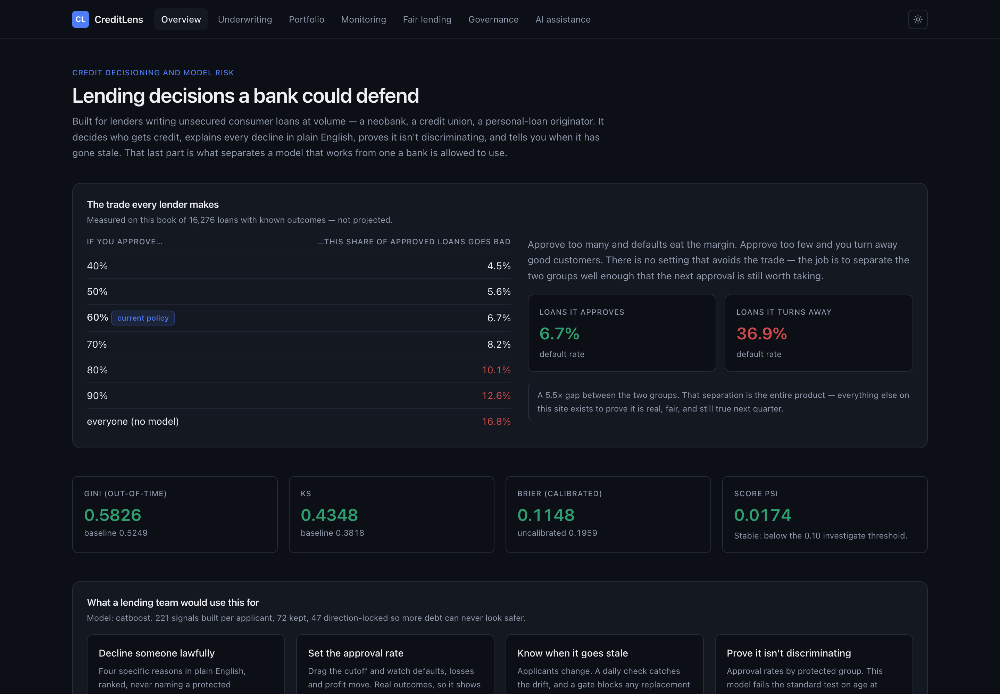
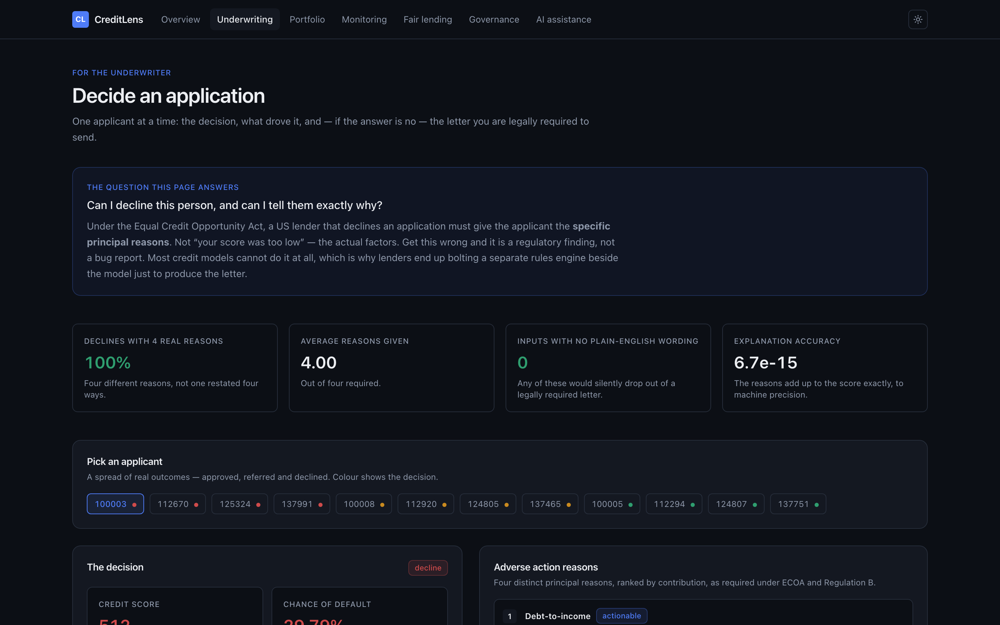
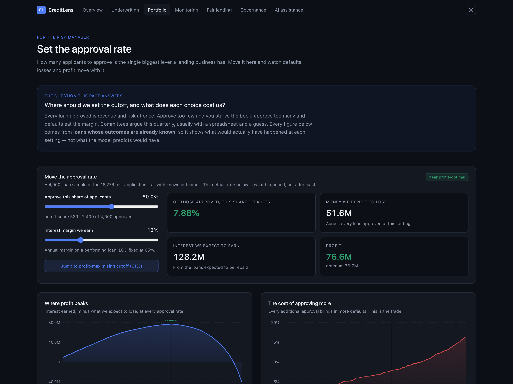
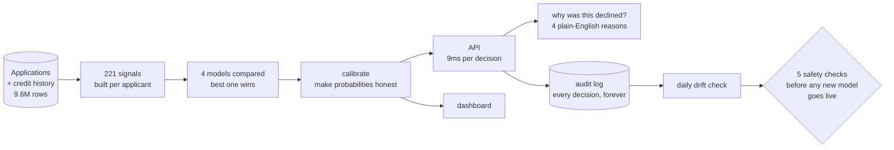

# CreditLens

**Automated lending decisions a bank could actually defend — to a customer, a
regulator, and an auditor.**

### [→ Try the live demo](https://creditlens-seven.vercel.app)



---

## Who this is for

Any lender making a high volume of small, unsecured credit decisions — a
neobank, a credit union, a personal-loan originator, a buy-now-pay-later
provider. The kind of business where thousands of applications arrive a month
and a human cannot look at each one.

It replaces the three things those teams typically run on: a spreadsheet of
hand-written rules, a manual underwriter for every file, or a bought-in bureau
score nobody can explain to the customer it declined.

## The problem

Lending is a balance with money on both sides.

**Approve too many** and defaults eat the margin. **Approve too few** and you
turn away good customers and leave revenue on the table — and someone who
deserved credit doesn't get it.

Here's that trade, measured on this project's own 16,276-loan test book:

| If you approve… | …this share of approved loans goes bad |
|---|---|
| 40% of applicants | 4.6% |
| **60%** *(the policy here)* | **6.7%** |
| 90% of applicants | 12.6% |
| everyone | 16.8% |

Every extra approval is more revenue *and* more loss. There is no setting that
avoids the trade — the job is to find the point where the model separates the
two groups well enough that the next approval is still worth taking.

**This model does separate them.** At a 60% approval rate, the loans it approves
default at **6.7%**, while the ones it turns away default at **36.9%** — five
times the rate. That gap is the entire product.

### But being accurate isn't enough to ship

Three more things stand between a working model and one a bank is allowed to
use, and they're where most projects stop:

**You must explain a "no".** In the US, decline someone and you're legally
required to tell them the specific reasons — not "your score was low". Every
decline here produces four distinct, plain-English reasons, and never names a
protected characteristic like age.

**You must prove it isn't discriminating.** Regulators test whether protected
groups are approved at similar rates. This project measures that, reports where
it **fails**, and shows what fixing it would cost.

**You must know when it goes stale.** Applicants in 2027 won't look like those
in 2025. A daily check watches for that drift, and an automated gate blocks any
replacement model that isn't demonstrably safer.

## What it does

Send it an application, and about 9 milliseconds later you get back:

- **A risk estimate** — the chance this loan isn't repaid, as an honest probability
- **A credit score**, 300–850, the familiar scale
- **A decision** — approve, decline, or refer to a human
- **Four specific reasons**, in plain English, if the answer is no



And the risk manager's view — move the approval rate, watch the money move:



And around the decision itself:

| | |
|---|---|
| **Risk dashboard** | Move the approval rate and watch losses and profit move with it |
| **Audit trail** | Every decision stored with the exact inputs, reasons and model version |
| **Fairness testing** | Approval rates by protected group, measured every time the model changes |
| **Drift monitoring** | Daily check on whether applicants still look like the training data |
| **Promotion gate** | Five automated checks a new model must pass before it can go live |
| **Draft notices** | AI-written decline letters, restricted to reasons the model actually gave |

## Does it actually work?

Tested on 16,276 applications the model had never seen — and specifically on
loans issued *later* than the ones it learned from, because that's the honest
test. Real lending doesn't let you predict the past.

| Measure | Score | In plain terms |
|---|---|---|
| **Gini 0.5826** | good | How well it separates people who repay from people who don't. 0 is a coin flip, 1 is perfect. Real credit models live around 0.4–0.6 |
| **KS 0.4348** | good | Same idea, different lens. Above 0.25 is considered usable |
| **Brier 0.1148** | good | Whether the probabilities are *honest*. When it says 7%, roughly 7 in 100 really do default |
| **PSI 0.0174** | stable | Whether today's applicants still look like the ones it trained on. Above 0.25 would mean retrain |
| **46 ms** | fast | Time to a full decision, including the explanation |
| **$1.00** | cheap | AI cost per 1,000 decisions |

That "honest probabilities" one nearly went wrong, and it's the mistake I'd most
want to point at. The model was good at *ranking* people but its actual numbers
were nonsense — it claimed 43% of applicants would default when the real figure
was 17%. Every accuracy metric looked healthy. A lender using those numbers to
forecast losses would have been wrong by two and a half times, and would have
priced and provisioned against a book that didn't exist. A calibration step fixes
it, and the dashboard shows the before and after.

## Try it

```bash
git clone https://github.com/SiddharthHiraou/creditlens && cd creditlens
make setup        # install
make data         # generate the dataset (50k applicants, 9.6M rows)
make train        # train the model — about 6 minutes
make up           # start everything: API, database, cache, dashboard
```

Then score an application:

```bash
curl -s -X POST localhost:8000/v1/score \
  -H "X-API-Key: demo-key-underwriter" -H "Content-Type: application/json" \
  -d @artifacts/one_payload.json
```

```
pd 0.2979 | score 512 | decline | 9.4ms
reasons: Debt-to-income · Repayment record · Delinquency on credit file · Prior applications
```

## How it fits together



## A few things worth pointing out

**Every decline gets four *different* reasons — 100% of them.** That sounds
trivial. It isn't: the naive version returns four ways of saying "your debt is
too high", which technically satisfies nobody and legally satisfies less.

**Age never appears as a reason.** The model's single most useful signal has age
baked into it, which is a problem because age is a protected characteristic. It's
disclosed as a credit-score reason instead, so the applicant is told something
they can act on and no protected trait is ever named.

**The fairness page reports a failure.** Younger applicants are approved at 38%
of the rate of older ones. That fails the standard regulatory test, and I could
find no legal fix that closes the gap. It's on the dashboard in red rather than
quietly omitted, because a fairness section that only reports passes isn't worth
reading.

**Nothing gets promoted on a "close enough".** A new model must beat five checks
against the one already running. Fail any of them and it doesn't ship — no
override. I tested it by deliberately building a bad model to confirm it gets
rejected, because a safety check you've only tried on good inputs isn't a safety
check.

**The move-the-slider tool uses real outcomes.** On the dashboard you can drag
the approval rate and watch losses and profit move. Those numbers come from what
*actually happened* to those loans, not from what the model guessed.

## What it is and isn't built for

**Built for:** unsecured consumer instalment loans — the kind a neobank, credit
union or personal-loan lender writes at volume, roughly 5,000 to 1,500,000 in
principal over 12 to 60 months.

**Not built for:** mortgages, secured lending, commercial credit, credit cards,
pricing, or collections. It has never been validated on those and its
probabilities would not transfer. The score measures a **loan**, not a person —
it is not a judgement of anyone's character or general creditworthiness.

**Not a replacement for an underwriter.** The referral band exists precisely
because the applications nearest the cutoff are where the model is least certain
and a human adds the most. Any automated decline is reversible by an underwriter
with a written reason, and that reversal is recorded against the original.

### Honest limitations

- **The data is synthetic.** The real datasets need a manual download I couldn't
  automate. The code reads the real files the moment they exist, but no number
  here describes real borrowers, and none of it should be quoted as evidence
  about real lending.
- **It fails the fairness test on age.** Younger applicants are approved at 38%
  of the rate of older ones. I could find no legal fix that closes the gap. That
  needs a lawyer and a fair-lending specialist, not more engineering.
- **The AI writing features have never made a live call.** No API key was
  available. The guardrails around them are tested; the live behaviour isn't.
- **It's a portfolio project.** It is not running anyone's lending, and it would
  need retraining on real data plus a compliance review before it could.

## Want more detail?

The deep material lives in `docs/`, written for people who want it:

| | |
|---|---|
| [Model card](docs/model_card.md) | What it's for, how well it works, where it breaks |
| [Validation report](docs/model_validation_report.md) | An independent-style review, structured the way regulators expect |
| [Fairness findings](docs/fairness_findings.md) | The disparity, measured, and what fixing it would cost |
| [Credit policy](docs/credit_policy.md) | The rules a lender would actually operate under |
| [Data dictionary](docs/data_dictionary.md) | All 221 signals and where each comes from |
| [Decisions log](docs/adr/) | 10 notes on choices made — including the ones I got wrong first |
| [Demo script](docs/demo_script.md) | A three-minute walkthrough |

## Built with

Python · Polars · LightGBM / XGBoost / CatBoost · Optuna · SHAP · Fairlearn ·
MLflow · FastAPI · ONNX · Postgres · Redis · Prefect · Next.js · Docker · Terraform

275 tests, 73% coverage, CI green.
