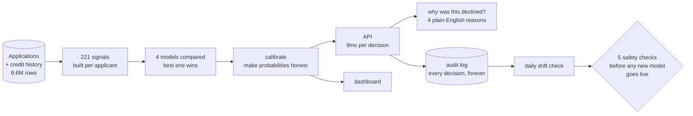

# CreditLens

**Deciding who gets a loan — and being able to explain why.**

### [→ Try the live demo](https://creditlens-seven.vercel.app)


---

## The problem

A bank gets a loan application. Someone has to decide: approve it, decline it,
or have a human look closer.

Getting that decision right is only half the job. In the US, if you turn someone
down you are legally required to tell them *specifically why*. Your regulator
will ask whether the model treats younger applicants differently. And in a year,
when a loan goes bad, someone will ask exactly how that decision was made.

Most machine learning projects answer the first half. **CreditLens is built
around the second half**, because that is the part that decides whether a model
is allowed anywhere near real customers.

## What it does

Send it an application, and about 9 milliseconds later you get back:

- **A risk estimate** — the chance this loan isn't repaid, as a real probability
- **A credit score**, 300–850, the familiar scale
- **A decision** — approve, decline, or refer to a human
- **Four specific reasons**, in plain English, if the answer is no


Around that sits the rest of it: a dashboard for risk managers, drift monitoring,
fairness testing, an audit trail for every decision, and an automated gate that
blocks a new model from going live unless it clears five safety checks.

## Does it actually work?

Tested on 16,276 applications the model had never seen — and specifically on
loans issued *later* than the ones it learned from, because that's the honest
test. Real lending doesn't let you predict the past.

| Measure | Score | In plain terms |
|---|---|---|
| **Gini 0.5826** | good | How well it separates people who repay from people who don't. 0 is a coin flip, 1 is perfect. Real credit models live around 0.4–0.6 |
| **KS 0.4348** | good | Same idea, different lens. Above 0.25 is considered usable |
| **Brier 0.1148** | good | Whether the probabilities are *honest*. When it says 7%, roughly 7 in 100 really do default |
| **PSI 0.0174** | stable | Whether today's applicants still look like the ones it trained on. Above 0.25 would mean retrain |
| **46 ms** | fast | Time to a full decision, including the explanation |
| **$1.00** | cheap | AI cost per 1,000 decisions |

That last "honest probabilities" one nearly went wrong, and it's the mistake I'd
most want to point at. The model was accurate at *ranking* people but its actual
numbers were nonsense — it claimed 43% of applicants would default when the real
figure was 17%. Every accuracy metric looked healthy. If you'd used those numbers
to estimate losses, you'd have been wrong by two and a half times. A calibration
step fixes it, and the dashboard shows the before and after.

## Try it

```bash
git clone https://github.com/SiddharthHiraou/creditlens && cd creditlens
make setup        # install
make data         # generate the dataset (50k applicants, 9.6M rows)
make train        # train the model — about 6 minutes
make up           # start everything: API, database, cache, dashboard
```

Then score an application:

```bash
curl -s -X POST localhost:8000/v1/score \
  -H "X-API-Key: demo-key-underwriter" -H "Content-Type: application/json" \
  -d @artifacts/one_payload.json
```

```
pd 0.2979 | score 512 | decline | 9.4ms
reasons: Debt-to-income · Repayment record · Delinquency on credit file · Prior applications
```

## How it fits together



## A few things worth pointing out

**Every decline gets four *different* reasons — 100% of them.** That sounds
trivial. It isn't: the naive version returns four ways of saying "your debt is
too high", which technically satisfies nobody and legally satisfies less.

**Age never appears as a reason.** The model's single most useful signal has age
baked into it, which is a problem because age is a protected characteristic. It's
disclosed as a credit-score reason instead, so the applicant is told something
they can act on and no protected trait is ever named.

**The fairness page reports a failure.** Younger applicants are approved at 38%
of the rate of older ones. That fails the standard regulatory test, and I could
find no legal fix that closes the gap. It's on the dashboard in red rather than
quietly omitted, because a fairness section that only reports passes isn't worth
reading.

**Nothing gets promoted on a "close enough".** A new model must beat five checks
against the one already running. Fail any of them and it doesn't ship — no
override. I tested it by deliberately building a bad model to confirm it gets
rejected, because a safety check you've only tried on good inputs isn't a safety
check.

**The move-the-slider tool uses real outcomes.** On the dashboard you can drag
the approval rate and watch losses and profit move. Those numbers come from what
*actually happened* to those loans, not from what the model guessed.

## What this isn't

Being straight about the limits, because they matter:

- **The data is synthetic.** The real datasets need a manual download I couldn't
  automate. The code reads the real files the moment they exist, but no number
  here describes real borrowers.
- **The AI writing features have never made a live call.** No API key was
  available. The guardrails around them are tested; the live behaviour isn't.
- **It fails the fairness test on age**, as above. That needs a lawyer, not more
  engineering.
- **It's a portfolio project.** It is not running anyone's lending.

## Want more detail?

The deep material lives in `docs/`, written for people who want it:

| | |
|---|---|
| [Model card](docs/model_card.md) | What it's for, how well it works, where it breaks |
| [Validation report](docs/model_validation_report.md) | An independent-style review, structured the way regulators expect |
| [Fairness findings](docs/fairness_findings.md) | The disparity, measured, and what fixing it would cost |
| [Credit policy](docs/credit_policy.md) | The rules a lender would actually operate under |
| [Data dictionary](docs/data_dictionary.md) | All 221 signals and where each comes from |
| [Decisions log](docs/adr/) | 10 notes on choices made — including the ones I got wrong first |
| [Demo script](docs/demo_script.md) | A three-minute walkthrough |

## Built with

Python · Polars · LightGBM / XGBoost / CatBoost · Optuna · SHAP · Fairlearn ·
MLflow · FastAPI · ONNX · Postgres · Redis · Prefect · Next.js · Docker · Terraform

275 tests, 73% coverage, CI green.
